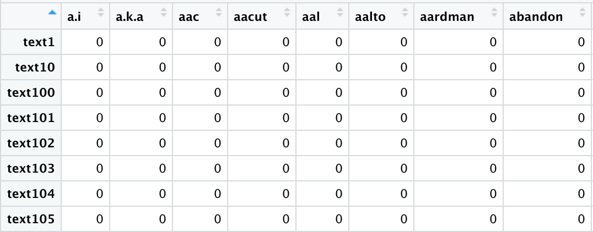

```{r}
library(readr)
library(tidyverse)
library(tidytext)
library(quanteda)
library(tokenizers)

library(reshape2)
text <- read.csv("raw/complete.csv")

```

## Make Document Matrix and Cleaning

Standard way tokens -\> matrix -\> dataframe `tidy()` is the way to convert object into standard dataframe. A lot `na` value would be included because each document matrix contains different terms. When join them into dataframe, they took all the terms.

```{r}
dfs <- text %>%
  pull(abstractText) %>%
  tokenize_word_stems() %>%
  tokens(remove_punct = TRUE,
  remove_symbols = TRUE,
  remove_numbers = TRUE,
  remove_url = TRUE,
  remove_separators = TRUE,
  split_hyphens = FALSE) %>%
  tokens_select(pattern = stopwords("en"), selection = "remove") %>%
  tokens_select(c("develop", "research", "project"), selection = "remove") %>% 
  tokens_select(pattern = "\\w*[0-9]+\\w*\\s*", valuetype = "regex", selection = "remove") %>%
  dfm() %>%
  tidy() %>%
  dcast(document ~ term)

dfs[is.na(dfs)] <- 0 # remove na value
df <- dfs[,-1] 
rownames(df) <- as.numeric(gsub("text", "", dfs$document)) # add first column as row name
```

 Note that rowname is a string to number of document is acutally not in order

You need two librarys to find optimal number of K (optimal number of cluyster). Provided by [this website](https://www.datanovia.com/en/lessons/determining-the-optimal-number-of-clusters-3-must-know-methods/). Takes hell to load. Basically there are two methods: \* Silhouette \* Elbow Method

This one called "Silhouette" method. A high average silhouette width indicates a good clustering.

## Determine Number of Cluster

```{r}
library(factoextra)
library(NbClust)

fviz_nbclust(df, kmeans, method = "silhouette") +
  labs(subtitle = "Silhouette method")
```


```{r echo=FALSE}
fviz_nbclust(df, kmeans, method = "wss") +
    geom_vline(xintercept = 8, linetype = 2)+
  labs(subtitle = "Elbow method")
```


Reference for `kmean` functions:

Forgy, E. W. (1965). Cluster analysis of multivariate data: efficiency vs interpretability of classifications. *Biometrics*, **21**, 768--769.

Hartigan, J. A. and Wong, M. A. (1979). Algorithm AS 136: A K-means clustering algorithm. *Applied Statistics*, **28**, 100--108. doi: [10.2307/2346830](https://doi.org/10.2307/2346830).

Lloyd, S. P. (1957, 1982). Least squares quantization in PCM. Technical Note, Bell Laboratories. Published in 1982 in *IEEE Transactions on Information Theory*, **28**, 128--137.

MacQueen, J. (1967). Some methods for classification and analysis of multivariate observations. In *Proceedings of the Fifth Berkeley Symposium on Mathematical Statistics and Probability*, eds L. M. Le Cam & J. Neyman, **1**, pp. 281--297. Berkeley, CA: University of California Press.
