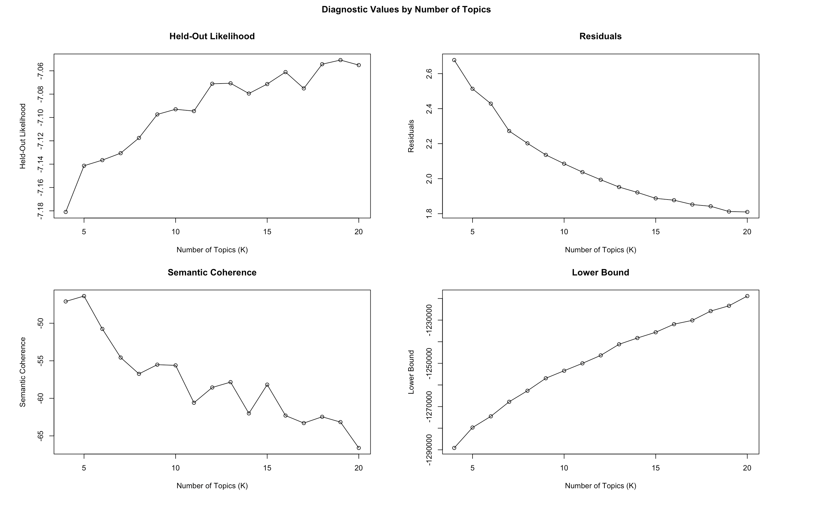

Goal is to attach meta data as well as able to chose what words to remove

```{r message=FALSE, warning=FALSE, include=FALSE}
library(readr)
library(tidyverse)
library(ggplot2)
library(tokenizers)
library(plotly)
```

```{r message=FALSE}
AIbyTopic <- read_csv("raw/AIbyTopic.csv")
complete <- read_csv("raw/complete.csv")

theme_set(theme(
          panel.grid.major = element_blank(),
          panel.grid.minor = element_blank(),
          panel.border = element_blank(),
          panel.background = element_rect(fill = "#f7f7f7"),
          plot.background = element_rect(fill = "white")
        ))

AIbyTopic %>%
  dplyr::select(FundingOrgName, LeadROName, AwardPounds, StartDate, EndDate, ProjectReference, Title) %>%
  mutate(StartDate = as.Date(StartDate, format = "%d/%m/%Y")) %>%
  mutate(EndDate = as.Date(EndDate, format = "%d/%m/%Y")) %>%
  mutate(duration = EndDate - StartDate) %>%
  mutate(dailyAward = AwardPounds/as.numeric(duration)) %>%
  ggplot(aes(y = dailyAward, label = LeadROName, label1= Title, label2 = ProjectReference)) + 
  geom_linerange(aes(xmin = StartDate, xmax = EndDate, y = dailyAward), color = "#363636") +
  geom_point(aes(x = StartDate), color = "#363636") + 
  geom_point(aes(x = EndDate), color = "blue") -> g

ggplotly(g)
```

```{r}
df <- read_csv("raw/complete.csv")

df %>%
  dplyr::select(abstractText, X1) %>%
  pull(abstractText) %>%
  textProcessor(metadata = df, 
                lowercase = TRUE,
  removestopwords = TRUE,
  removenumbers = TRUE,
  removepunctuation = TRUE
    ) -> cooked

out <- with(cooked, prepDocuments(documents,vocab, meta))
attach(out)

stm(documents = documents, vocab = vocab, K = 10, data = meta, init.type = "Spectral", verbose = FALSE) -> first_stm

first_stm %>%
  tidy(matrix = "beta") %>%
  group_by(topic) %>%
  top_n(10, beta) %>%
  ungroup %>%
  arrange(topic, -beta) %>%
  mutate(term = reorder(term, beta)) %>%
  ggplot(aes(x = beta, y = term, fill = factor(topic))) +
  geom_col(show.legend = FALSE) + 
  facet_wrap(~ topic, scales = "free")
```


```{r}
df %>%
  dplyr::select(abstractText, X1) %>%
  pull(abstractText) %>%
  textProcessor(metadata = df, 
                lowercase = TRUE,
  removestopwords = TRUE,
  removenumbers = TRUE,
  removepunctuation = TRUE,
  customstopwords = c("develop", "research", "project", "will")
    ) -> cooked

out <- with(cooked, prepDocuments(documents,vocab, meta))
attach(out)

stm(documents = documents, vocab = vocab, K = 10, data = meta, init.type = "Spectral", verbose = FALSE) -> second_stm

second_stm %>%
  tidy(matrix = "beta") %>%
  group_by(topic) %>%
  top_n(10, beta) %>%
  ungroup %>%
  arrange(topic, -beta) %>%
  mutate(term = reorder(term, beta)) %>%
  ggplot(aes(x = beta, y = term, fill = factor(topic))) +
  geom_col(show.legend = FALSE) + 
  facet_wrap(~ topic, scales = "free")
```


```{r}
plot(first_stm)
plot(second_stm)
```

# Find K

```{r}
findK <- searchK(documents, vocab, K = c(4:20), data = meta)
plot(findK)
```



# LDAvis tools

This tool automatically reorder topics in order of decreasing proportion. For proportion use plot()

```{r}
devtools::install_github("cpsievert/LDAvis")
plot(second_stm)
toLDAvis(second_stm, documents, R = 10, reorder.topics = FALSE)
```

|                  |                                                                                                                                                                                   |
|------------------|-----------------------------------------------------------------------------------------------------------------------------------------------------------------------------------|
| `reorder.topics` | Passed to [`createJSON`](http://127.0.0.1:9703/help/library/LDAvis/html/createJSON.html) "Should LDAvis re-order the K topics in order of decreasing proportion? Default is True" |

```{r}
findThoughts(second_stm, text = df$abstractText, topics = 1, n = 1, where = 1)
```

You can see there that topic 1 is about natural language processing... which is the lowest proportion and labeled in LDA as 9.

# Meta Data

```{r}
predict_topics <- estimateEffect(
  formula = 1:10 ~ wagerate + StartDate, 
  stmobj = second_stm, 
  metadata = meta, 
  uncertainty = "Global")

predict_topics %>%
  tidy() %>%
  filter(p.value < 0.01) 
```

This function performs a regression where topic-proportions are the outcome variable. This allows us to conditional expectation of topic prevalence given document characteristics. Use of the method of composition allows us to incorporate our estimation uncertainty in the dependent variable. Mechanically this means we draw a set of topic proportions from the variational posterior, compute our coefficients, then repeat. To compute quantities of interest we simulate within each batch of coefficients and then average over all our results.

The formula specifies the nature of the linear model. On the left hand-side we use a vector of integers to indicate the topics to be included as outcome variables. If left blank then the default of all topics is used. On the right hand-side we can specify a linear model of covariates including standard transformations. Thus the model `2:4 ~ var1 + s(var2)` would indicate that we want to run three regressions on Topics 2, 3 and 4 with predictor variables `var1` and a *b-spline transformed* `var2`. We encourage the use of *spline functions* for non-linear transformations of variables.

The function allows the user to specify any variables in the model. However, we caution that for the assumptions of the method of composition to be the most plausible the topic model should contain at least all the covariates contained in the `estimateEffect` regression. However the inverse need not be true. The function will automatically check whether the covariate matrix is singular which generally results from linearly dependent columns. Some common causes include a factor variable with an unobserved level, a spline with degrees of freedom that are too high, or a spline with a continuous variable where a gap in the support of the variable results in several empty basis functions. In these cases the function will still estimate by adding a small ridge penalty to the likelihood. However, we emphasize that while this will produce an estimate it is only identified by the penalty. In many cases this will be an indication that the user should specify a different model.

The function can handle factors and numeric variables. Dates should be converted to numeric variables before analysis.

## regression with spin transformation

```{r}
predict_topics <- estimateEffect(
  formula = 1:10 ~ s(wagerate) + s(StartDate), 
  stmobj = second_stm, 
  metadata = meta, 
  uncertainty = "Global")

predict_topics %>%
  tidy() %>%
  filter(p.value < 0.01) 
```

{width="472"} {width="469"}

```{r}
findThoughts(second_stm, topics = 6, n = 1, where = 5, texts = df$title)
```

```{r}
topicCorr(second_stm) %>%
  plot()
```

This is pretty good this means the topics are isolated.

In the early 2000s, it has been established universities and publicly funded research instituted undertake the fundamental science research, upon which specialist research firms develops and corporates commercialise.

 

Stock market imperatives inclines to commercialise research quicker than they address any ethic concerns.

 

None of the three can do it alone. Cooke (2000) has demonstrated with the road map from base research to commercialisation of \_\_ Givic. In this example, numerous scientific discoveries stacks on one another. It takes 40 years for the product to mature and enters the market, as which, as Cooke argues, is far beyond life expectancy of any specialist research firms or venture capitalists.
