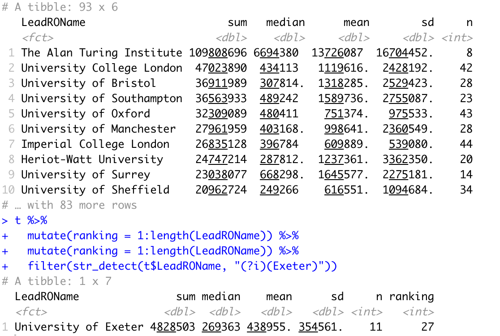
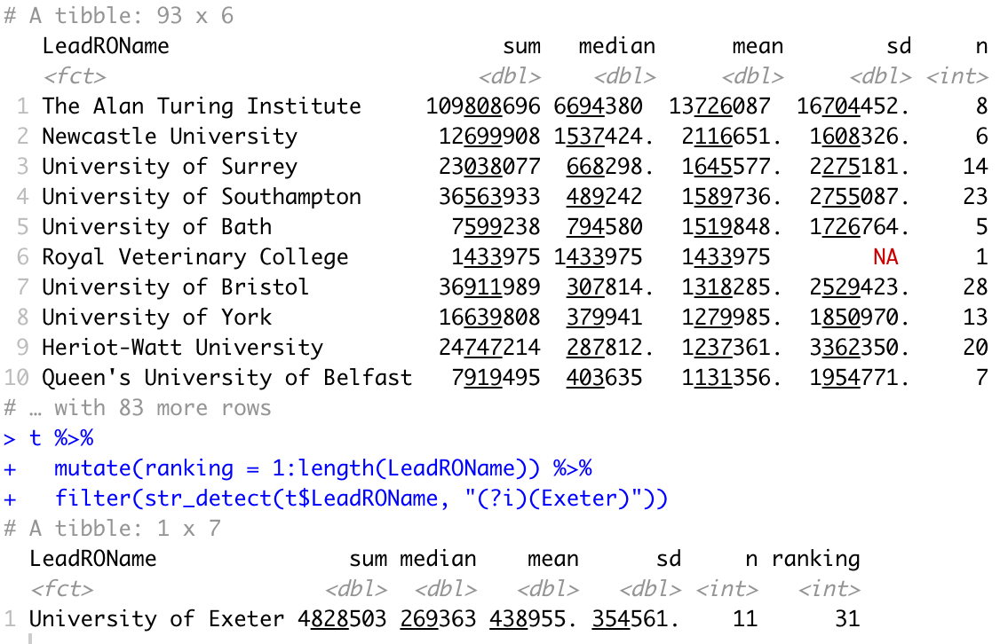

```{r}
library(readr)
library(tidyverse)
library(ggplot2)
library(plotly)

AIbyTopic <- read_csv("raw/AIbyTopic.csv")
complete <- read_csv("raw/complete.csv")

theme_set(theme(
          panel.grid.major = element_blank(),
          panel.grid.minor = element_blank(),
          panel.border = element_blank(),
          panel.background = element_rect(fill = "#f7f7f7"),
          plot.background = element_rect(fill = "white")
        ))
```

# Look At Sum

```{r}
AIbyTopic %>%
  select(FundingOrgName,ProjectCategory,LeadROName,AwardPounds) %>%
  mutate(FundingOrgName = as.factor(FundingOrgName)) %>%
  mutate(LeadROName = factor(LeadROName)) %>%
  mutate(ProjectCategory = as.factor(ProjectCategory)) %>%
  group_by(LeadROName) %>%
  summarize(sum = sum(AwardPounds), median = median(AwardPounds), mean = mean(AwardPounds), sd = sd(AwardPounds), n = length(AwardPounds)) %>%
  arrange(-sum)  -> t 
t
t %>%
  mutate(ranking = 1:length(LeadROName)) %>%
  mutate(ranking = 1:length(LeadROName)) %>% 
  filter(str_detect(t$LeadROName, "(?i)(Exeter)")) 
```

{width="440"}

```{r echo = FALSE, results = 'asis`}
# Untility function to make tables
library(knitr)
kable(t[1:10,], caption = "Rankings by Total Pounds")
kable(t %>%
  mutate(ranking = 1:length(LeadROName)) %>% 
  filter(str_detect(t$LeadROName, "(?i)(Exeter)")))
```

```{r}
AIbyTopic %>%
  select(FundingOrgName,ProjectCategory,LeadROName,AwardPounds) %>%
  mutate(FundingOrgName = as.factor(FundingOrgName)) %>%
  mutate(LeadROName = factor(LeadROName)) %>%
  mutate(ProjectCategory = as.factor(ProjectCategory)) %>%
  group_by(LeadROName) %>%
  summarize(sum = sum(AwardPounds), median = median(AwardPounds), mean = mean(AwardPounds), sd = sd(AwardPounds), n = length(AwardPounds)) %>%
  arrange(-mean)  -> t 
t
t %>%
  mutate(ranking = 1:length(LeadROName)) %>%
  filter(str_detect(t$LeadROName, "(?i)(Exeter)"))
```

{width="435"}

method: looking at average. But might be more worthwhile by looking at research facility size... but you know what classify as "research staff" is sketchy. For instance Exeter, staff undertake dual duty as a researcher and a teaching staff.

University of Exeter actually performs poorly compares with others. The ranking goes down as by looking at mean project funding.

A few new university pops up from the list. For example University of Bath and Newcastle University, both are not part of the Russell group but on average, both performs secure funding good funding.

University of London appears absorb large amount of funding. The reason is because large amount of project that were taken in London (42 from recorded time).

Surrey and Southampton, both outside close to London, stable both in terms of total funding secured and average, suggesting London may be a potential AI innovation cluster of UK. This finding collision with the fact London being the finance hub of UK but our findings suggest AI clusters to be outside London. Part of Research Funding allocation process is to justify london pricing to the funding. This does not seems to affect the analysis very much... as we can see the average project award went down the ranks. This could reflect the fact of competition. Outside London may not be the only AI innovation clusters in the UK. Make university that are close to city regions pop ups the list. For instance, Manchester, Belfast. This suggest that mapping that incorporate geo data may be very very helpful for this analysis It suggests map based cluster analysis may be useful for analysis This finding incolision with the balanced *Triple Helix Model literature*, *innovation cluster* literature.

# Project Durations

first look at project price

```{r}
AIbyTopic %>%
  mutate(StartDate = as.Date(StartDate, format = "%d/%m/%Y")) %>%
  mutate(EndDate = as.Date(EndDate, format = "%d/%m/%Y")) %>%
  mutate(duration = EndDate - StartDate) %>%
  mutate(dailyAward = AwardPounds/as.numeric(duration)) %>%
  mutate(LeadROName = factor(LeadROName)) %>%
  group_by(LeadROName) %>%
  summarize(mean = mean(duration), sd = sd(duration), n = length(duration)) %>%
  arrange(mean) -> t
t
t %>%
  mutate(ranking = 1:length(LeadROName)) %>%
  filter(str_detect(t$LeadROName, "(?i)(Exeter)"))
```

# Study the Outliner

Click to inspect individual project that

```{r}
library(htmlwidgets)
AIbyTopic %>%
  mutate(StartDate = as.Date(StartDate, format = "%d/%m/%Y")) %>%
  mutate(EndDate = as.Date(EndDate, format = "%d/%m/%Y")) %>%
  mutate(duration = EndDate - StartDate) %>%
  mutate(price = AwardPounds/as.numeric(duration)) -> df 

df %>%
  ggplot(aes(y = price, label = LeadROName, label1= Title, label2 = ProjectReference)) + 
  geom_linerange(aes(xmin = StartDate, xmax = EndDate, y = price), color = "#363636") +
  geom_point(aes(x = StartDate), color = "#363636") + 
  geom_point(aes(x = EndDate), color = "blue") -> g

ggplotly(g) %>%
  style(traces = 2, text = paste(df$StartDate,"\n",df$duration, "days")) %>%
  style(traces = 1, text = paste( df$PIFirstName, df$PISurname,"\n",df$duration, "days")) %>%
  style(traces = 3, customdata = df$GTRProjectUrl, text = paste(df$EndDate,"\n", df$LeadROName, "\n",df$Title)) %>%
  onRender("
    function(el) { 
      el.on('plotly_click', function(d) { 
        var url = d.points[0].customdata;
        window.open(url);
      });
    }
  ") #set up click event that open URL
```

Trim outliner

```{r}
AIbyTopic %>%
  select(FundingOrgName,ProjectCategory,LeadROName,AwardPounds) %>%
  mutate(FundingOrgName = as.factor(FundingOrgName)) %>%
  mutate(LeadROName = factor(LeadROName)) %>%
  mutate(ProjectCategory = as.factor(ProjectCategory)) %>%
  group_by(LeadROName) %>%
  summarize(mean = mean(AwardPounds, trim = 0.25), sd = sd(AwardPounds), n = length(AwardPounds)) %>%
  arrange(-mean) %>%
  mutate(ranking = 1:length(LeadROName)) %>%
  filter(str_detect(t$LeadROName, "(?i)(Exeter)")) 
```

```{r}

```
