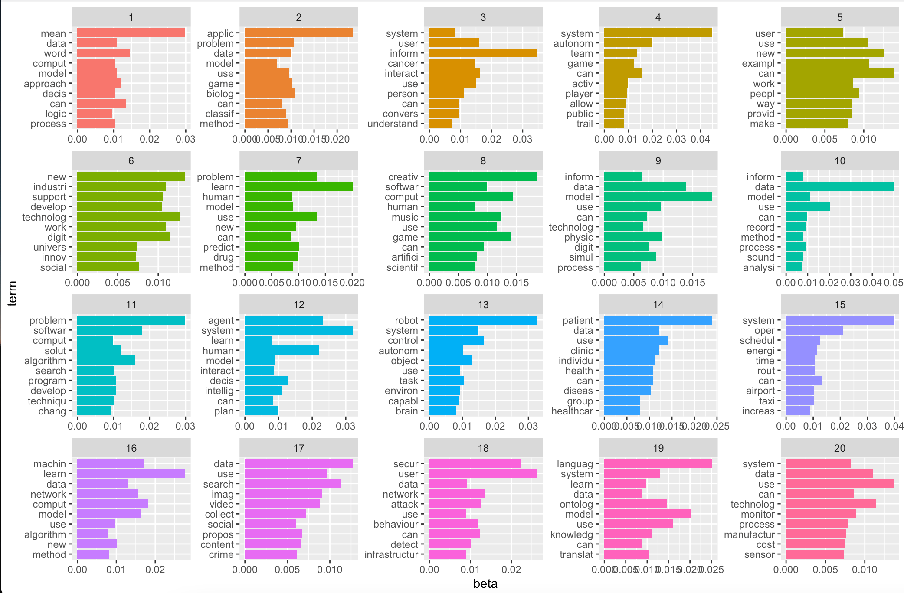

```{r}
setwd("~/Dropbox/Projects/Business Project - Topic Modeling")
library(readr)
library(tidyverse)
library(ggplot2)
library(tokenizers)
library(plotly)
library(tidytext)

library(quanteda)
library(stm)
```

```{r}
complete <- read_csv("raw/complete.csv")
AIbyTopic <- read_csv("raw/AIbyTopic.csv")
cooked_csv <- read_csv("raw/cooked.csv")
```

# Topic Modeling
```{r}
complete %>%
  dplyr::select(abstractText, X1) %>%
  pull(abstractText) %>%
  textProcessor(metadata = df, 
                lowercase = TRUE,
  removestopwords = TRUE,
  removenumbers = TRUE,
  removepunctuation = TRUE,
  customstopwords = c("develop", "research", "project", "will")
    ) -> cooked

out <- with(cooked, prepDocuments(documents,vocab, meta))
attach(out)

stm(documents = documents, vocab = vocab, K = 20, data = meta, init.type = "Spectral", verbose = FALSE) -> stm_20
```

# Visualise Topics
```{r}
## ggplot
stm_20 %>%
  tidy(matrix = "beta") %>%
  group_by(topic) %>%
  top_n(10, beta) %>%
  ungroup %>%
  arrange(topic, -beta) %>%
  mutate(term = reorder(term, beta)) %>%
  ggplot(aes(x = beta, y = term, fill = factor(topic))) +
  geom_col(show.legend = FALSE) + 
  facet_wrap(~ topic, scales = "free")
## default
plot(stm_20)
## LDAvis
toLDAvis(stm_20, documents, R = 10, reorder.topics = FALSE)
```



# Explore Topics / Duplications
```{r}
df <- complete
findThoughts(stm_20, topic = c(18), texts =  df$ProjectId, n = 5)[[2]] -> id

AIbyTopic %>%
  filter(ProjectId == "165CAEC8-8C43-4C4C-AD1B-6F8BF394D56D" | ProjectId == "368EFF37-EE61-4ECC-87EF-A38BE0560667") %>%
  select(LeadROName, Title, GTRProjectUrl) %>%
  pull(GTRProjectUrl)
```
  https://gtr.ukri.org:443/projects?ref=EP/N028112/2
  https://gtr.ukri.org:443/projects?ref=EP/N028112/1
These two project has different id but share same project abstract and project id. They are essentially the two part of the same project with same project abstract but the principle leader is different.

So you see the topic modeling actually contains a lot of duplication. The number of project partner is enormous in the sense...

Not just this this one below has 5 project of the same length

```{r}
# An example of 5 project in a row that has exactly same abstract text

# find project url of those things and open them
cooked_csv %>%
  filter(ProjectId == '8E93BE78-0E07-4E83-8C63-CCB21B4BB70A' | ProjectId == 'EC57FD55-DD19-4DC2-BC9C-2E6320D987B6' | ProjectId == 'E04E24C5-AE50-4B57-AACE-EB15717F5968' | ProjectId == 'D3C287D8-B051-4DFE-86BD-484968AABBD2' | ProjectId == 'F1D1AE3A-334D-4B03-B9F1-A754CF5776E7') -> df
df %>%
  select(LeadROName,Title, duration, price, StartDate, EndDate) %>%
  ggplot(aes(y = price, label = LeadROName, label1= Title)) + 
  geom_linerange(aes(xmin = StartDate, xmax = EndDate, y = price), color = "#363636") +
  geom_point(aes(x = StartDate), color = "#363636") + 
  geom_point(aes(x = EndDate), color = "blue") + 
  geom_text(aes(x = StartDate + duration/2, y = price, label = Title), nudge_y = 10, size = 2.5) +
  labs(title = "5 Research Porject that were under the same Name") -> g

ggplotly(g) %>%
  style(traces = 2, text = paste(df$StartDate,"\n",df$duration, "days")) %>%
  style(traces = 1, text = paste( round(df$price),"\n", df$PIFirstName, df$PISurname,"\n",df$duration, "days")) %>%
  style(traces = 3, customdata = df$GTRProjectUrl, text = paste(df$EndDate,"\n", df$LeadROName, "\n",df$Title)) %>%
  onRender("
    function(el) { 
      el.on('plotly_click', function(d) { 
        var url = d.points[0].customdata;
        window.open(url);
      });
    }
  ") #set up click event that open URL
  
```
```
%>%
  pull(GTRProjectUrl) -> url
for(i in url){
  browseURL(i)
}
```
there are a lot of project duplications like this. Within project 1 there are five of the them share the same name.. 

### Price
```{r}
topic_n = 18
take_out = 2
L = ""
for( i in findThoughts(stm_20, topic = c(topic_n), texts =  complete$ProjectId, n = take_out)[[2]]){
  L = paste0(L, "ProjectId == ", shQuote(i), collapse=" | ")
}

cooked_csv %>%
  filter(eval(parse(text = L))) -> df
df %>%
  select(LeadROName,Title, duration, price, StartDate, EndDate) %>%
  ggplot(aes(y = price, label = LeadROName, label1= Title)) + 
  geom_linerange(aes(xmin = StartDate, xmax = EndDate, y = price), color = "#363636") +
  geom_point(aes(x = StartDate), color = "#363636") + 
  geom_point(aes(x = EndDate), color = "blue") + 
  labs(title = paste("Explore topics")) + 
  geom_text(aes(x = StartDate + duration/2, y = price, label = Title), nudge_y = 20, size = 2.5) -> g

ggplotly(g) %>%
  style(traces = 2, text = paste(df$StartDate,"\n",df$duration, "days")) %>%
  style(traces = 1, text = paste(round(df$price),"\n", df$PIFirstName, df$PISurname,"\n",df$duration, "days")) %>%
  style(traces = 3, customdata = df$GTRProjectUrl, text = paste(df$EndDate,"\n", df$LeadROName, "\n",df$Title)) %>%
  onRender("
    function(el) { 
      el.on('plotly_click', function(d) { 
        var url = d.points[0].customdata;
        window.open(url);
      });
    }
  ") # set up click event that open URL

```

```{r}
i = 4
#findThoughts(stm_20, topic = c(i), texts =  complete$abstractText, n = 5)
findThoughts(stm_20, topic = c(i), texts =  complete$Title, n = 30)
```


### award pounds only
```{r}
topic_n = 18
take_out = 2
L = ""
for( i in findThoughts(stm_20, topic = c(topic_n), texts =  complete$ProjectId, n = take_out)[[2]]){
  L = paste0(L, "ProjectId == ", shQuote(i), collapse=" | ")
}

cooked_csv %>%
  filter(eval(parse(text = L))) -> df
df %>%
  select(LeadROName,Title, duration, price, StartDate, EndDate, AwardPounds) %>%
  ggplot(aes(y = AwardPounds, label = LeadROName, label1= Title)) + 
  geom_linerange(aes(xmin = StartDate, xmax = EndDate, y = AwardPounds), color = "#363636") +
  geom_point(aes(x = StartDate), color = "#363636") + 
  geom_point(aes(x = EndDate), color = "blue") + 
  labs(title = paste("Explore topics")) + 
  geom_text(aes(x = StartDate + duration/2, y = AwardPounds, label = Title), nudge_y = 20, size = 2.5) -> g

ggplotly(g) %>%
  style(traces = 2, text = paste(df$StartDate,"\n",df$duration, "days")) %>%
  style(traces = 1, text = paste(round(df$price),"\n", df$PIFirstName, df$PISurname,"\n",df$duration, "days")) %>%
  style(traces = 3, customdata = df$GTRProjectUrl, text = paste(df$EndDate,"\n", df$LeadROName, "\n",df$Title)) %>%
  onRender("
    function(el) { 
      el.on('plotly_click', function(d) { 
        var url = d.points[0].customdata;
        window.open(url);
      });
    }
  ") # set up click event that open URL

```

```{r}
i = 4
#findThoughts(stm_20, topic = c(i), texts =  complete$abstractText, n = 5)
findThoughts(stm_20, topic = c(i), texts =  complete$Title, n = 30)
```

```{r}
topicCorr(stm_20) %>%
  plot()
```


